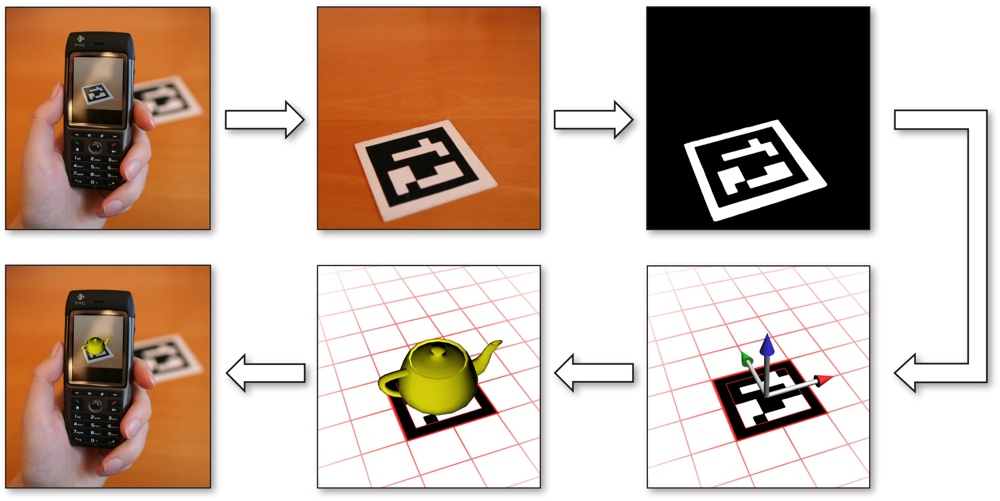
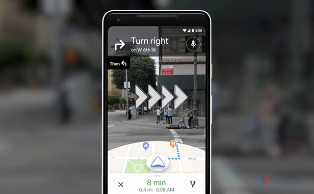
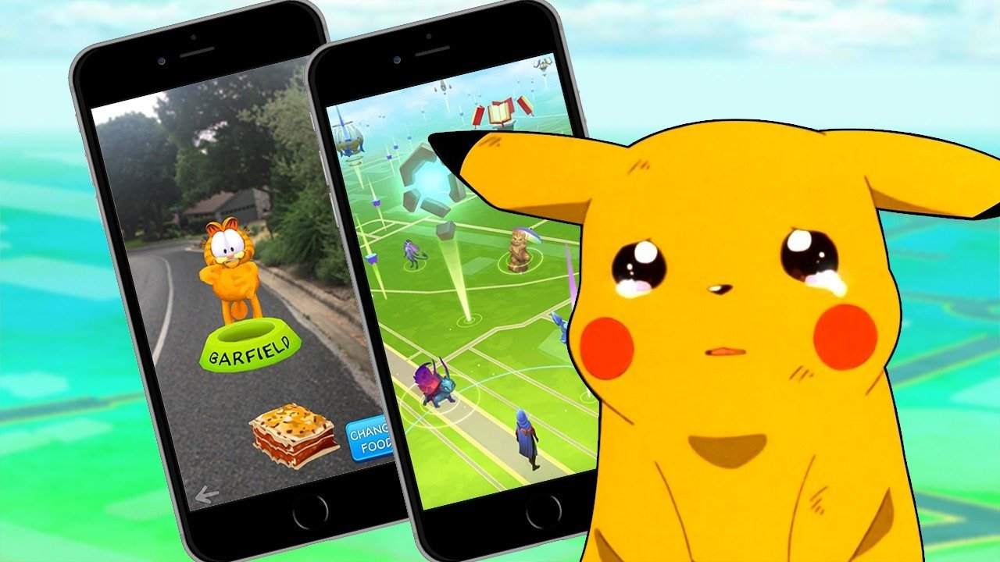
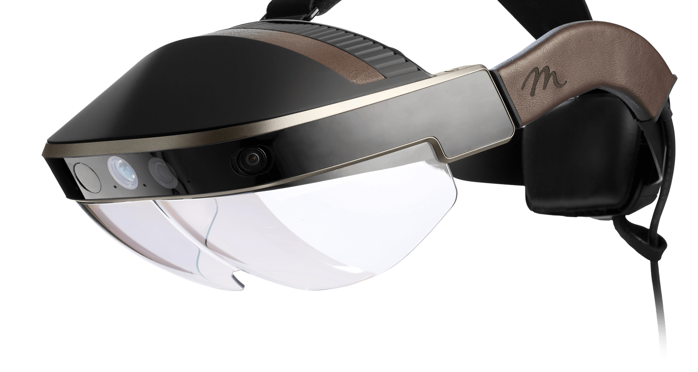
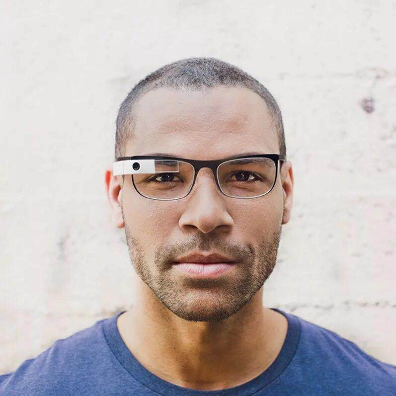
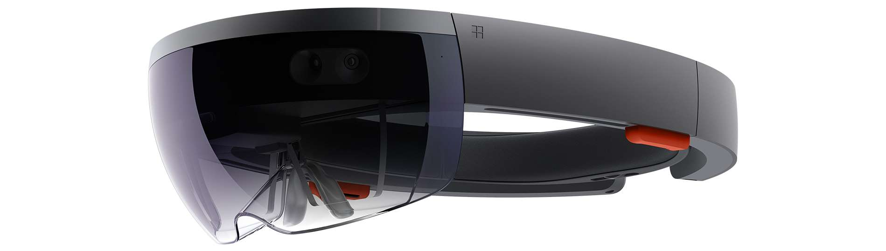
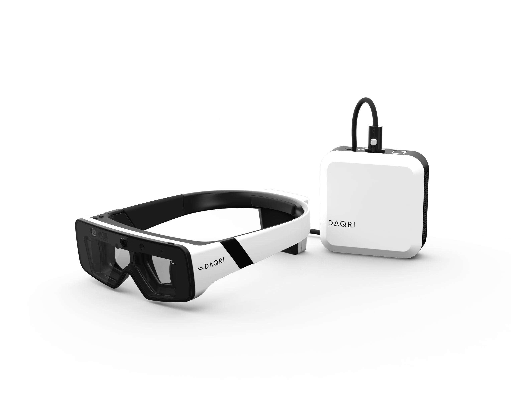
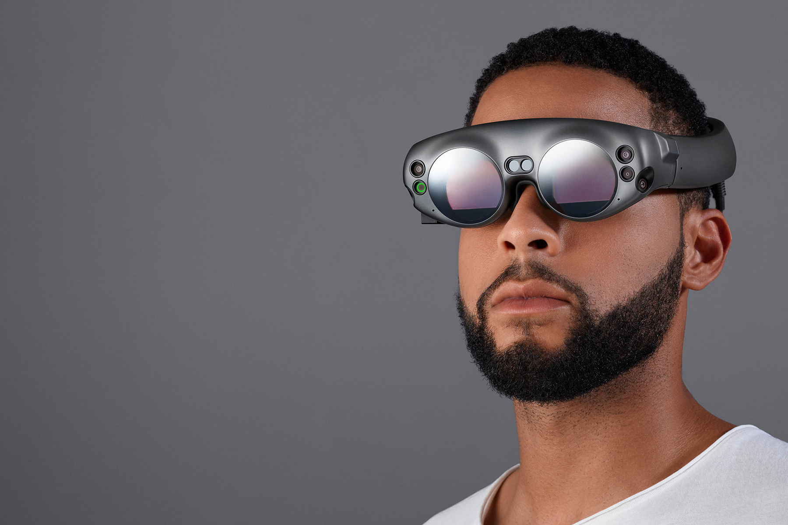
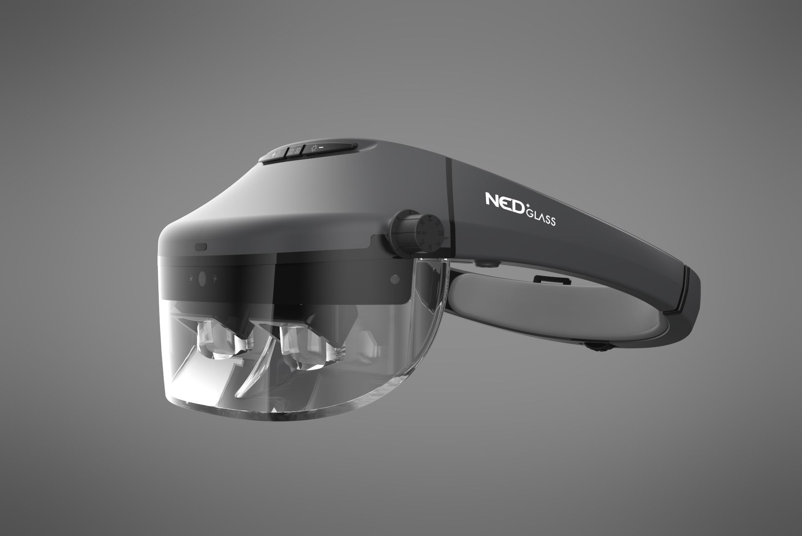
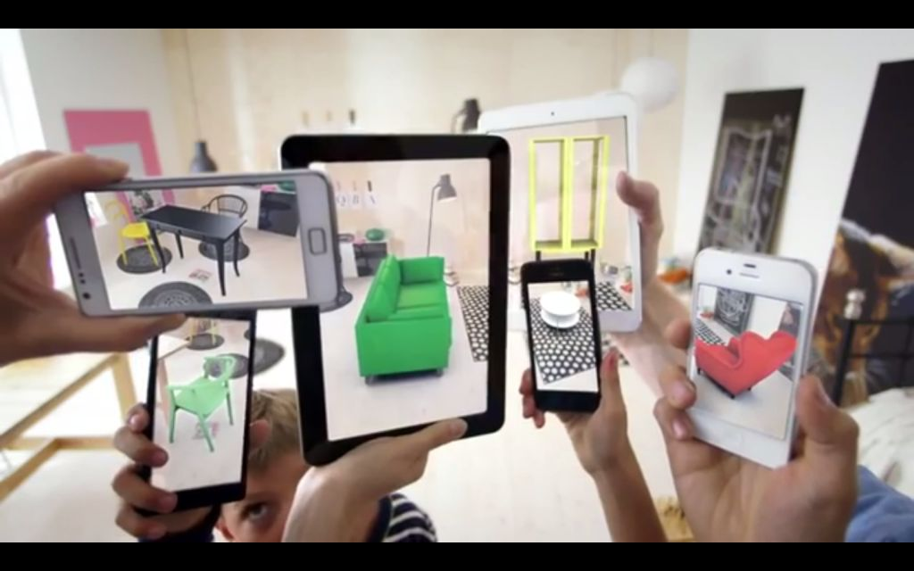

# 增强现实概述

增强现实（Augmented Reality，AR）是一种实时计算摄像机影像的位置及角度并加上相应视觉特效的技术。这种技术的目标是把原本在现实世界的一定时间空间范围内很难体验到的实体信息（视觉信息、声音、味道、触觉等），通过计算机技术模拟后叠加，在屏幕上把虚拟影像套在现实场景中，从而达到超越现实的感官体验。

想要实现增强现实技术，需要将计算机图形学与计算机视觉相应的算法模块相结合。计算机图形学技术用来进行虚拟特效的渲染，虚拟特效的姿态和表现形式往往是根据计算机视觉算法得到的。

计算机图形学主要研究如何在计算机中表示图形，以及利用计算机进行图形的计算、处理和显示的相关原理和算法。狭义地理解，计算机图形学是计算机视觉的逆过程：计算机图形学是用计算机来画图像的学科，计算机视觉是根据获取的图像来理解和识别其中物体的三维信息等。计算机图形学的研究内容非常广泛，其中与增强现实技术联系最紧密的是图形硬件（GPU）加速、特效渲染和动画仿真。现在的渲染技术已经能够嫁给你皮肤、树木、花草、水、烟雾、毛发等各种物体渲染得非常逼真。在动画方面，也已经可以实现高度物理真实感的动态模拟，比如人体动画、关节动画以及真实模拟水、气、云、烟雾、爆炸和燃烧等物理现象。好的渲染特效可以确保增强现实技术的良好感官体验。

## 增强现实的特征

通过将增强现实与其相近或相异的概念进行比较，可以更加清晰地理解增强现实的概念。

首先，虚拟现实（Virtual Reality，VR）是与需要调制所有感觉信息的增强现实相近的概念。共同点是两者都旨在最终能够自由地产生所有感觉信息；两者也都要求实时进行三维空间场景的信息处理，在感知信息或信息呈现等许多基本技术方面有相似之处。但是，虚拟现实隔绝了从现实世界获得的感觉信息，取而代之的是人为再现的感觉信息，这一点与增强现实有着根本性的区别。

其次，增强现实与可穿戴计算技术的相近之处是，用户在现实世界的各种活动中都交互地利用计算机信息。但是，可穿戴计算并不要求呈现的信息必须与用户所处的现实世界相对应。例如，社交网络软件SNS的新消息显示在智能眼镜上，但这并不会对眼前的现实世界产生任何扩展效果。

再者，数字合成技术所带来的视觉效果与增强现实的效果可以匹敌。但最大的不同是，数字合成技术在多数情况下不能实时生成视觉效果，后期制作需要花费大量的人力和时间。

如此可见，增强现实之所以是增强现实，有三个重要因素：①现实世界与虚拟世界双方信息都可被利用；②上述信息可实时且交互利用；③虚拟信息以三维的形式对应现实世界。增强现实的三要素（图2）是1997年由Azuma提出的，作为增强现实的狭义定义已广为人知。

还有一个与增强现实相近的概念，就是所谓的增强虚境（Augmented Virtuality，AV）。增强现实的基础说到底还是现实世界，利用虚拟的信息将其增强扩展；而增强虚境的基础则是虚拟世界，利用现实世界的信息将其增强扩展。例如，给虚拟美术馆里加上了再现实物美术品的虚拟展示物，那么该展示物就使虚拟世界（虚拟美术馆）得到了增强扩展。无论是增强现实还是增强虚境，根据用途或应用的目的，现实世界信息和虚拟世界信息的混合搭配比例差别是很大的。如果一点虚拟信息要素都没有的话，那就单单是现实世界；如果完全丢弃现实世界的信息，只剩虚拟信息的话，则与虚拟现实等价无二。也就是说，如果将现实世界和虚拟现实世界当作两端，那么就可以大致区分出靠近现实世界一侧各层次的增强现实及靠近虚拟现实一侧各层次的增强虚境，由此构成边界并不明确的技术系列。Milgram等人1994年就研究这样一个技术连续体，提出了Reality-Virtuality Continuum （R-V连续体）的概念。另外，更广义的一个概念，包括增强现实和增强虚境在内的，某种比例的现实世界与虚拟世界的混合体，则称作混合现实MR（Mixed Reality）。

## 发展历程

【增强现实历史，从固定设备向移动设备发展，引出增强现实的多种表现形式】

1999年，推出了以白底黑框图案作为标识图的增强现实系统。这种系统为了加速识别，都使用构图简单的标识图，容错率低，辨识能力差，还必须预先编码并载入程序中。每次改变标识图，都要重新编译应用程序，给使用者造成很多麻烦。后来，QR Code作为标识图被应用在增强现实系统中，这种识别图具有识别速度快、格式标准化、容错率高、可负载容量大以及标识图制作简单等优点，使得更多的开发者以此工作流程为模板加入增强现实应用开发的热潮中。在2010年，Domhan[^1]成功将增强现实系统在智能手机的Android平台上实现，如下图所示。

2010年以后，随着硬件设备运算能力的提升， 更丰富的计算机视觉算法被应用到增强现实系统中。基于识别图的系统开始可以对更复杂且更具独特性的自然特征图像进行检测识别。无标识图的增强现实系统也逐渐开始普及，应用神经网络算法实现的类别识别以及基于SLAM系统实现的对空间的实时定位和检测，拓宽了增强现实技术的应用领域。

## 增强现实表现形式

【阐述多种增强现实的实现方式，引出后面章节】

增强现实技术主要依赖于图像的识别技术，而增强现实的表现形式基本上可以分为两类，标记式和无标记式。

### 标识式

标记式的增强现实系统必须通过事先读取的标识图信息（QR Code、自然特征图像）为系统提供识别标准，并定位相关联的虚拟模型对于标识图的相对位置，之后将虚拟模型叠加在真实画面中呈现在屏幕上。标记式的增强现实也是目前最常见的一种增强现实表示形式。

### 无标识式

无标识式的增强现实系统不需要特定的标识图，系统可以通过更多样的方法实现增强现实特效。

其中一种是基于地理位置服务（LBS）的增强现实系统。LBS通过电信移动运营商的无线电网络（如GSM、CDMA）或外部定位方式（如GPS）获取移动终端用户的位置信息（地理坐标），在地理信息系统平台的支持下为用户提供相应服务。这种增值服务业务包含有两层含义：一是确定移动设备或用户所在的地理位置；二是提供与位置相关的各类信息服务，简称“定位服务”。也就是说，用户用手机定位到当前的地理位置，LBS可以根据该地理位置现实附近的餐厅、宾馆、电影院等活动场所的名称、地址等相关信息。LBS的商业模式丰富多样，例如激励用户主动签到来记录自己所在的位置、为用户提供周边生活服务的推广以及建立以地理位置为基础的小型社区等。

将增强现实技术和LBS相结合的产品（可以称之为“AR地图”）也是当下护粮网产品中的一大热点。AR地图的玩法多种多样，比如AR地图红包，在不同的地理位置可以用手机扫到不同商家的推广红包；AR地图导航，在摄像机拍摄的真实街景上叠加直观的虚拟路标，指引用户抵达目的地；AR实景地图，在摄像机拍摄的真实街景中，把附近与生活服务相关的信息叠加在屏幕上。

风靡一时的增强现实手机游戏Pokemon GO，将存在于虚拟世界的宠物小精灵带进了现实生活，其中同样运用了LBS定位服务。游戏中的实境景点、口袋站等地标的分布得到了谷歌地图的支持。游戏中的野生口袋妖怪可能出现在不同国家的不同地方，包括街道、建筑、公园、海边等各式各样的区域。关于小精灵的刷新则更有讲究，比如地面系、岩石系、火系、格斗系的小精灵受到实境温度、湿度、云覆盖、天气、风向等因素影响，而水系小精灵分布则与河畔、沼泽地、盐水海滩、码头、湿地公园、池塘等地形因素有关，这些基于地理环境的设定为游戏本身平添了诸多乐趣。

另外，这款游戏的另一项无标记式的增强现实技术在于，利用手机自身的陀螺仪对玩家进行简单定位，计算用户和口袋妖怪的相对位置关系，从而实现增强现实技术，将憨态可掬的小精灵与真实环境融为一体，呈现在玩家面前，如下图所示。

但是，亦有业内人士对Pokemon GO不以为然，认为它不是真正的AR产物。因为Pokemon GO并没有对环境进行深度检测，而只是将口袋妖怪以一个固定的位姿在手机屏幕上进行渲染。因此，想要实现更接近真实的用户体验，Pokemon GO可以加入一些SLAM技术。SLAM技术可以通过多种不同的感应器实时认知玩家所在的场景，根据真实场景构建对应的3D点云，再通过对3D点云的分析来了解现实场景的几何构造，比如哪里是地面、桌面，而哪里又是墙壁。了解这些信息后，就可以在正确的地点生成正确的虚拟模型，以符合现实场景规律的方式让玩家和虚拟模型互动。当玩家看到精灵从地面跳到桌子再跳到自己床上的瞬间，一定非常震撼。再者，真实场景中的口袋妖怪始终和玩家保持着“距离”。当玩家向前移动时，口袋妖怪不会相应地“放大”，反而是偏移了原本的位置。这是由于Pokemon GO的定位系统比较简略。如果采用视觉里程计或者SLAM的相关技术，玩家就可以呼唤自己喜爱的口袋妖怪，甚至下命令指挥它们；如果用手势识别代替手指滑动来操作精灵球，抛掷精灵球和收服口袋妖怪的体验也会更加逼真。

由Pokemon GO的例子可以看出，大多数无标识式的增强现实技术需要依赖于SLAM的空间定位和实时检测，才能将虚拟模型和真实环境进行逼真的融合。另外，基于LBS或者手机自身的传感器加以定位，也都是实现简略增强现实的渠道。还有一些基于图像识别但不局限于标识图识别的增强现实技术也属于无标识式，比如文字、车牌、人脸和手势识别等。

## 便携式AR硬件设备

人的视野整体上达到水平约200°、垂直约125°（下75°、上50°）。而人眼的辨识能力在视力为2.0的情况下大约是0.5分（1/120°）的视角，因此，该值便成为了实现高精细影像的参考值。如果想全视野范围提供适合人眼最大辨识能力的影像的话，就需要水平方向约12000像素和垂直方向约7200像素。以目前的技术到达这个水平还有困难，就产生了低角度分辨率 / 广视场与高角度分辨率 / 窄视场之间的权衡问题。让我们快速浏览一下带有AR功能的硬件设备。这对我们理解与部署不同类型的设备会有所帮助。

- **Meta 2** 是一种使用传感器阵列实现手势交互和位置跟踪的头盔显示器（Head-Mounted Display，HMD），它的视场角为90°，分辨率为2560*1440。

  

- **Google Glass** 是一种像眼镜的设备，可以将内容直接渲染到设备上。

  

- **Microsoft HoloLens**

  

- **DAQRI**

  

- **Magic Leap**

  

- 耐德佳

  

- 其他设备

## 增强现实应用领域

增强现实在很多场合都可以发挥其对真实环境进行增强显示输出的特点，下面将分别介绍AR在不同领域中的典型应用。

### 医疗卫生领域

通过虚拟的X光将病人的内脏器官投影到他们的皮肤上，轻易地对需要进行手术的部位进行精确定位。此外，增强现实也是医生新手学习手术实操的一大助手，用增强现实技术进行手术模拟时，医生的视线里还会显示出手术步骤以供参考。

### 旅游展览领域

游客在参观展览时，通过增强现实设备可以看到于展览品或者古建筑有关的更详细的信息说明；参观古迹时，可以通过纪实视频与真实景点的叠加来还原历史的原貌；参观文物时，可以通过增强现实对破旧的或者被破坏的古物的残缺部分进行虚拟重构。

### 互动娱乐领域

对拍摄的视频进行人脸识别，为视频流中出现的人脸叠加一些可爱、有趣的虚拟动画，提升了视频的趣味性。现在已经有很多App推出了类似功能，如FaceU、抖音等，深受用户喜爱。

### 工业维修领域

通过显示器将多种辅助信息显示给用户，包括虚拟仪表的面板、被维修设备的内部结构和零件图对照等。

### 地图导航领域

将增强现实技术与LBS相结合，将道路和街道的名字及其他相关信息一起标记到现实地图中。现在也有汽车配件的商家将目的地方向、天气、地形和路况等交通信息投影到汽车的挡风玻璃上来实现增强现实的应用。

### 科普教育领域

将文本、图像、视频和音频叠加在教科书上，让学生在阅读的过程中用增强现实设备对准书目，通过更加丰富生动的方式了解书中的知识。例如地理课本上出现一个模拟的立体地球仪以供旋转和放大，又或者某以地理现象可以用一段视频进行附加讲解说明。

### 游戏领域

游戏行业是所有最新技术首先会涉足的行业之一。除了基于LBS增强现实的Pokemon GO，基于头戴式设备的增强现实游戏被广泛看好。玩家可以在真实的环境中与叠加的虚拟游戏进行互动，实现很好的沉浸式体验。同时，增强现实游戏也可以让位于全球不同地点的玩家，共同进入一个真实的自然场景，以虚拟替身的形式进行网络对战。

### 商业广告领域

这是增强现实应用最广泛的领域之一。增强现实所展示出的特效变化无穷，可以很好地达到吸引眼球和激起用户兴趣的作用，这与广告推销的目的不谋而合。最直接的应用方式便是以上提到的虚拟试戴。虚拟试戴（试穿）已开始应用于珠宝、眼镜、手表、服装、箱包和鞋帽行业，同时在美容、美发和美甲领域也出现了虚拟试妆应用。虚拟试戴（试穿）可以把虚拟产品叠加到客户的动态影像上，人体动作与虚拟产品同步交互，展示出逼真的穿戴或试妆效果。目前，虚拟试戴（试穿）系统主要用于成品和定制品的电商业务，通过互联网，在不易接触实物的情况下使用技术手段模拟最终效果。在商业实体店中，使用虚拟试戴（试穿）技术可以大大提高店面的驻足率、成交率和美誉度。这种应用既为客户提供了良好的体验，也大幅改进了销售和服务模式。

用AR技术实现家具的任意摆放是AR的典型应用之一。消费者可以使用移动设备把所选的模拟家具放置在自己的居室内，从而方便地测试家具的尺寸、风格、颜色和位置等。该应用还可以根据需要改变家具的尺寸和颜色，如下图所示。

## 增强现实工具包

在这一节，我们将会分析ARCore、ARKit和Vuforia的优劣势，由于ARToolkit被DAQRI收购后停止更新，故这里不再介绍。

### ARCore

ARCore是针对Android设备推出的AR应用开发平台，且已经推广至部分iOS设备。为了通过相机将虚拟内容叠加显示到真实场景中，ARCore使用了三种关键技术，即：运动跟踪（Motion Tracking）、环境理解（Environment Understanding）和光照估计（Light Estimation）。ARCore的工作原理是：通过移动时跟踪设备的位置构建其对真实世界的理解，它可以识别兴趣点，读取设备传感器数据，并能同时确定手机移动时的位置和姿态。在国内，ARCore当前仅能支持部分Android和iOS设备（[设备列表](https://developers.google.com/ar/discover/supported-devices)），如下所示：

- Xiaomi Mix 2S / Mi 8
- Huawei P20 / P20 Pro / Porsche Design Mate RS / Mate 20 Lite

如果没有上述设备，也可以使用Android模拟器来进行测试。这是一个非常明显的缺陷，因为并不是所有人都有特定型号的手机；此外，Android模拟器是一种实验性质的软件，会经常改变。ARCore的优点是在Unity3D和Unreal Engine平台下，提供与Android Studio一致的原生支持。

### ARKit

ARKit是在iOS 11 中引入的新框架，能够非常方便的为iPhone和iPad创建增强现实项目。ARKit的特性包括：

- TrueDepth相机
- 视觉惯性里程计
- 场景理解
- 光照估计
- 渲染优化

ARKit的缺点是它是一个实验性质的软件，经常改变，且需要苹果iPhone X手机才能使用TrueDepth相机。由于不能在Windows上编译Mac程序，因此仅仅是测试代码也需要一台macOS设备。尽管如此，其优点是可以与Unity3D和Unreal Engine融合，并可以使用A9、A10、A11等苹果处理器。换言之，它能够在iPhone 6S之后的设备上使用。

### Vuforia

Vuforia是当前最流行的增强现实开发平台，它支持如下设备：

- Android
- iOS
- UWP
- Unity3D 编辑器

Vuforia能够做的工作很多，包括多种类型物体的识别（如长方体、圆柱体和平面），文本和环境识别，VuMark（一种图像和二维码的组合）等。此外，使用Vuforia Object Scanner应用程序，可以扫描并创建物体目标。识别时还可以使用数据库（本地或云端存储均可）。Unity插件可以非常方便地集成到项目中，且功能强大。该平台的所有插件和功能可以免费使用，但是带有Vuforia水印。Vuforia开发版限制了VuMark的数量和云识别的次数，Cloud版具有如下功能：

- 云端数据库可存储100,000张图片
- 云端数据库支持调用10,000次/月
- 每月费用99美元
- 付费订阅后可去水印

尽管Vuforia开发版可以每月免费使用1,000个识别目标和1,000次云识别调用，但是它并不是100%免费的软件。

## 自研AR引擎概述

------

## 参考文献

[^1]: Domhan, Tobias, Kurs TIT07INA, and Gutachter der Dualen Hochschule. "Augmented reality on android smartphones." *Studiengangs Informationstechni. Dualen Hochschule Baden-Württemberg Stuttgart* (2010).

