# Unity插件开发与开源工具集成

**插件**是存储代码的文件，一般有两种类型：

- **原生插件**：Windows / macOS / iOS / Android等设备开发商仅提供一种或几种特定语言的编程接口才能实现某些系统级的调用，如APP调用、原生弹窗、震动等。Unity要想实现这些功能，就必须用相应语言编写实现这些功能的函数，编译为动态库后，在Unity中使用C#语言调用相应函数。
- **工具插件**：很多开源工具是用C/C++语言编写的，如OpenCV等，当Unity需要使用这些开源工具时，需要针对各个平台编译成库文件以供Unity使用。

本章将分别针对这两种类型的插件进行介绍。

## Unity原生插件开发

本节将使用C#、C++、Objective-C和Java分别针对跨平台、Windows、iOS和Andorid创建示例插件，每个插件实现的功能是返回两个参数之和。对于每个插件来说，不超过10分钟即可完成。完成后，需要在Unity或相应设备中进行测试。

对于AR应用和游戏来说，会受到一些前置条件的约束，这里也一样。如果使用Apple Mac系列计算机，有如下要求：

- macOS 10.14
- Xcode 10.0
- Unity 2018 for Mac
- Visual Studio Code

如果使用的是Windows计算机，有如下要求：

- Windows 10
- Visual Studio 2017
- Unity 2018 for Windows
- Android Studio 3

### 用C#语言插件实现跨平台开发

首先，我们使用C#来创建我们的第一个插件：

1. 打开Visual Studio并创建新项目。项目类型为Visual C#→Windows Desktop→Class Library (.NET Framework)。项目名称改为CSharpManagedPlugin, Framework版本为**3.5**，点击OK按钮。

   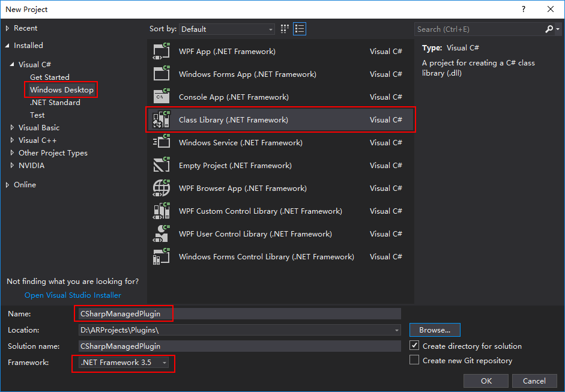

2. 创建工程后，将类的名称由Class1改为Addition。添加函数Addify，其包含参数a和b，返回a与b之和。如下所示：

   ```c#
   namespace CSharpManagedPlugin
   {
       public class Addition
       {
           public int Addify(int a, int b)
           {
               return a + b;
           }
       }
   }
   ```

3. 打开Unity，创建项目，名称为AREngine，类型为3D。在Asset下创建文件夹AREngine，并创建七个子文件夹，分别为Materials、Models、Plugins、PluginWrappers、Prefabs、Scenes和Scripts。将生成的CSharpManagedPlugin放入Plugins文件夹，如下所示：

   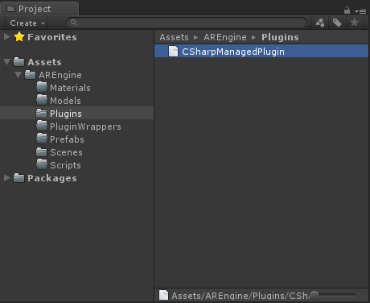

4. 如果设定的.NET版本小于或等于Unity版本，将不会收到错误信息，而且可以在编辑器、独立程序、WebGL、Linux、Windows和macOS上使用。

5. 点击PluginWrappers文件夹，创建脚本并命名为CSharpWrapper，双击打开Visual Studio进行编辑。托管插件是最简单的，我们仅需像调用非MonoBehavior脚本一样，直接调用插件函数即可，代码如下所示：

   ```c#
   using UnityEngine;
   
   public class CSharpWrapper : MonoBehaviour
   {
       // Use this for initialization
       void Start()
       {
           var addition = new CSharpManagedPlugin.Addition();
           var add = addition.Addify(5, 2);
           Debug.Log(add);
       }
   }
   ```

6. 在Unity的Hierarchy窗口，点击右键，选择Create Empty，创建一个空物体GameObject。选中该物体，在Inspector窗口，点击Add Component按钮，输入CSharpWrapper，即可将CSharpWrapper脚本挂载到物体下。点击运行，Console窗口输出如下所示：

   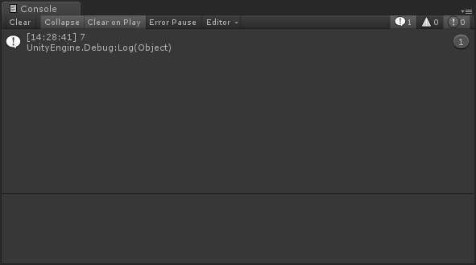

### 用C++语言插件实现Windows开发

这里将再次使用Visual Studio创建C++插件。

1. 打开Visual Studio并创建新项目。项目类型为Visual C++→Windows Desktop→Dynamic-Link Library (DLL)。项目名称改为NativeWindowsPlugin，点击OK按钮。

   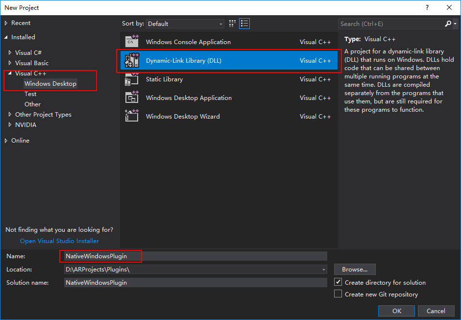

2. 头文件名为NativeWindowsPlugin.h，代码如下：

   ```c++
   #pragma once
   extern "C" {
   #if (defined(WIN32) || defined(__WIN32__))
   	__declspec(dllexport) int Addify(int a, int b);
   #else
   	int Addify(int a, int b);
   #endif
   }
   ```

3. 源文件名为NativeWindowsPlugin.cpp，代码如下：

   ```c++
   #include "stdafx.h"
   #include "NativeWindowsPlugin.h"
   
   int Addify(int a, int b)
   {
   	return a + b;
   }
   ```

4. Solution Configurations设置为**Release**，Solution Platforms设置为**x64**，之后在Solution Explorer选中工程NavitveWindowsPlugin，右击**Build**按钮，即可生成相应的dll文件，位置在x64/Release。

   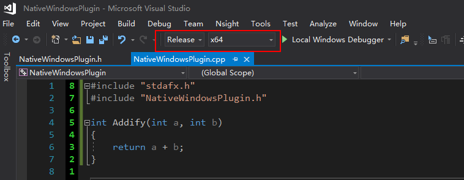

5. 将上步生成的dll文件拖放到Unity工程中的Plugins文件夹。点击PluginWrappers文件夹，创建脚本并命名为NativeWindowsWrapper，双击打开Visual Studio进行编辑，代码如下所示：

   ```c#
   using System.Runtime.InteropServices;
   using UnityEngine;
   
   public class NativeWindowsWrapper : MonoBehaviour {
   	[DllImport("NativeWindowsPlugin")]
   	public static extern int Addify(int a, int b);
   	
   	private void Start() {
   		var add = Addify(2, 4);
   		Debug.Log(add);
   	}
   }
   ```

6. 在Unity的Hierarchy窗口，点击右键，选择Create Empty，创建一个空物体GameObject。选中该物体，在Inspector窗口，点击Add Component按钮，输入NativeWindowsWrapper，即可将NativeWindowsWrapper脚本挂载到物体下。点击运行，Console窗口输出如下所示：

   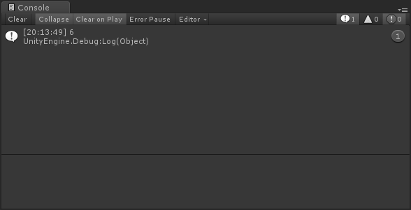

### 用Objective-C语言插件实现iOS开发

Objective-C是Apple版本的C语言，已经存在了很长时间。虽然Swift被设计用来取代Objective-C，但是Apple并没有将Objective-C降级，直到现在仍然是一个编程利器。这里将在**macOS**计算机上进行Objective-C插件的编程。

1. 打开Xcode，选择**Create a new Xcode project**，标签页选择**macOS**，页面下方选择**Library**，按**Next**按钮。

   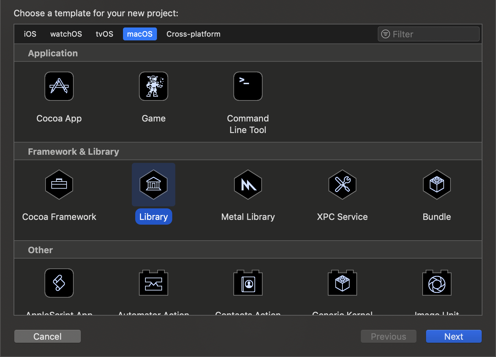

2. 设置ProductName为**ObjectiveCPlugin**，Orgnization Name和Identifier根据自己情况设置，如下所示。

   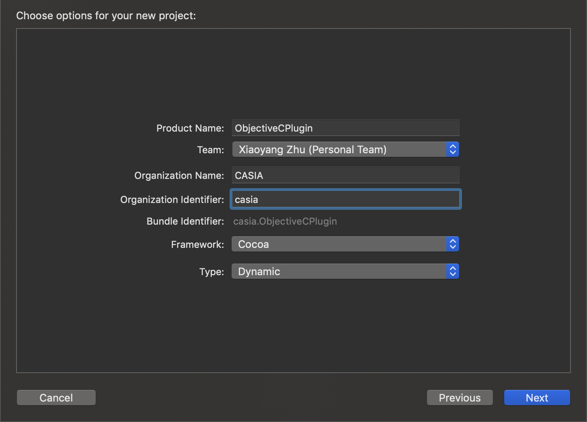

3. 头文件名为ObjectiveCPlugin.h，代码如下：

   ```objective-c
   #import <Foundation/Foundation.h>
   
   @interface ObjectiveCPlugin : NSObject
   int Addify(int a, int b);
   @end
   ```

4. 源文件名为ObjectiveCPlugin.m，代码如下：

   ```objective-c
   #import "ObjectiveCPlugin.h"
   
   @implementation ObjectiveCPlugin
   int Addify(int a, int b)
   {
       return a + b;
   }
   @end
   ```

5. 打开Unity，在Plugins文件夹下创建**iOS**文件夹，将上面的.h和.m文件放到该文件夹下。**注：iOS平台一般直接使用源文件，无需编译。**

6. 点击PluginWrappers文件夹，创建脚本并命名为ObjectiveCWrapper，双击打开Visual Studio Code进行编辑，代码如下所示：

   ```c#
   using System.Collections;
   using System.Runtime.InteropServices;
   using UnityEngine;
   using UnityEngine.UI;
   using System;
   
   public class ObjectiveCWrapper : MonoBehaviour {
       #if UNITY_IOS && !UNITYEDITOR
   	[DllImport("__Internal")]
   	public static extern int Addify(int a, int b);
   	#else
   	[DllImport("ObjectiveCPlugin")]
   	public static extern int Addify(int a, int b);
   	#endif
   
   	// Use this for initialization
   	void Start () {
   		var add = Addify(2, 3);
   		Debug.Log(add);
   	}
   }
   ```

7. 在Unity中将Platform改为**iOS**，点击**Build And Run**按钮，在弹出的对话框中Save As后填写希望iOS工程的保存位置，如Test，即可将Unity工程自动打包为Xcode工程，并编译出iOS应用，连上iPhone或iPad，即可在Xcode的Debug Area看到输出，如下所示。

   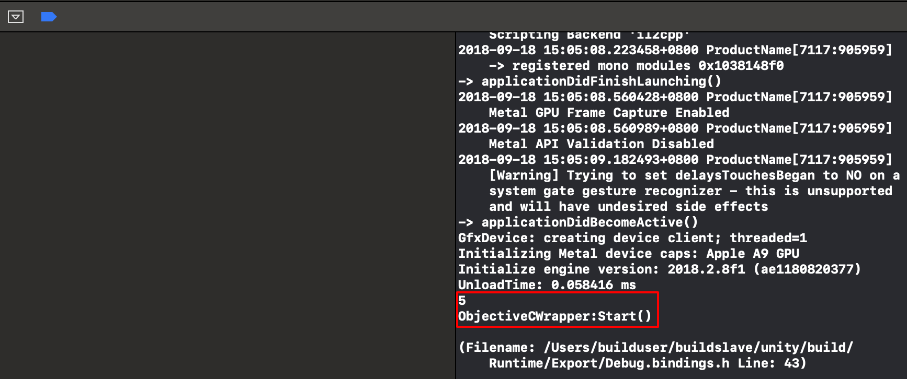

### 用Java语言插件实现Android开发

对于Java语言插件来说，有两种实现方式：一个是Java Library，编译为JAR文件，可以直接导入到Unity；另一个是Android Library，编译为AAR文件，包含C++和Java代码以及一些资源文件和Android Manifest文件，其中的.class和.jar文件需要在Android Studio编译后才能导入Unity。这两种插件都需要在Android设备或模拟器上才能运行，也就是不能在Unity编辑器里测试。下面将使用Android Studio创建插件。

1. 打开Android Studio，选择Start a new Android Studio project，在弹出的对话框中进行如下设置：

   

2. 点击**Next**按钮，之后在Target Android Decices对话框中勾选**Phone and Tablet**，并选择**API 21: Android 5.0 (Lollipop)**；点击**Next**按钮，在Add an Activity to Mobile中选择**Empty Activity**；点击**Next**按钮，最后点击**Finish**按钮。

3. 菜单栏依次选择**File**→**New**→**NewModule**，在打开的对话框中设置Application/Library name为**AndroidLibrary**，**Minimum SDK设为API 21:Android 5.0(Lollipop)**，Package name自动变为com.casia.androidlibrary，点击**Finish**按钮。Build这个项目，确保没有问题。

   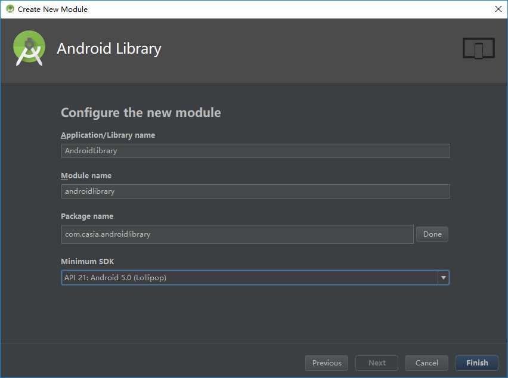

4. 选中androidLibrary下的Java文件夹中的**com.casia.androidlibrary**，右键选择New→Java，即可创建Java类，将其命名为**Addition**，点击**OK**按钮。 

   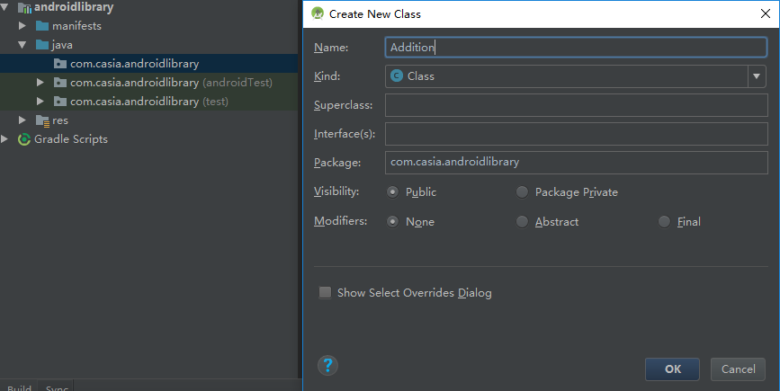

5. 在类Addition中添加函数Addify，其包含参数a和b，返回a与b之和。如下所示：

   ```java
   package com.casia.androidlibrary;
   
   public class Addition {
       public int Addify(int a, int b)
       {
           return a + b;
       }
   }
   ```

6. 菜单栏依次选择Build→Make Project，即可生成相应库文件，位置在\androidlibrary\build\outputs\aar，名字为androidlibrary-debug.aar。

7. 在Unity中，点击PluginWrappers文件夹，创建脚本并命名为JavaWrapper，双击打开Visual Studio Code进行编辑，代码如下所示：

   ```c#
   using System.Collections;
   using System.Collections.Generic;
   using UnityEngine;
   
   public class JavaWrapper : MonoBehaviour {
   
   	// Use this for initialization
   	void Start () {
   		#if UNITY_ANDROID && !UNITY_EDITOR
   		    var javaClass = new AndroidJavaObject("com.casia.androidlibrary.Addition");
   			int add = javaClass.Call<int>("Addify", 2, 2);
   			Debug.Log(add);
   		#endif
   	}
   }
   ```

8. 在Unity中将Platform改为**Android**，点击**Player Settings…**，在Other Settings对话框，**Identification**下**Package Name**设置为com.casia.arengine，**Minimum API Level**设置为Android 5.0 ‘Lollipop’ (API level 21) 。点击**Build And Run**按钮，在弹出的对话框中设置应用名称为AREngine，点击保存按钮，即可编译出Android应用。

9. 连上Android设备，打开AndroidSDK路径下的**tools**文件夹中的**monitor.bat**脚本，选择**LogCat**标签页，在**Saved Filters**下选择**Unity**，即可看到输出，如下所示。

   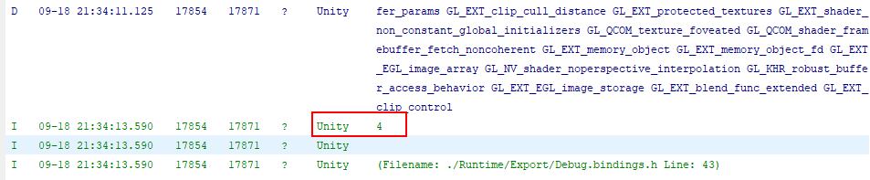

10. 参考链接：[Step-by-Step guide for developing Android Plugin for Unity3D](https://xinyustudio.wordpress.com/2015/12/31/step-by-step-guide-for-developing-android-plugin-for-unity3d-i/) 。

## 开源工具集成

### OpenCV集成

OpenCV是Open Computer Vision的缩写，是一个开源的计算机视觉和机器学习的软件库，由C++编写，由C++、Python、Java和Matlab接口以支持Windows、Linux、Android和macOS平台。OpenCV包含面部识别、物体识别、姿态识别、相机跟踪、物体跟踪、点云建模、图像拼接以及增强现实等多种算法。

#### 下载OpenCV和CMake

1. 下载OpenCV的Windows版本(https://sourceforge.net/projects/opencvlibrary/files/opencv-win/)，目前最新版是3.4.3，大小约174MB。创建一个文件夹OpenCV，点击运行，将其解压缩到该文件夹下。

   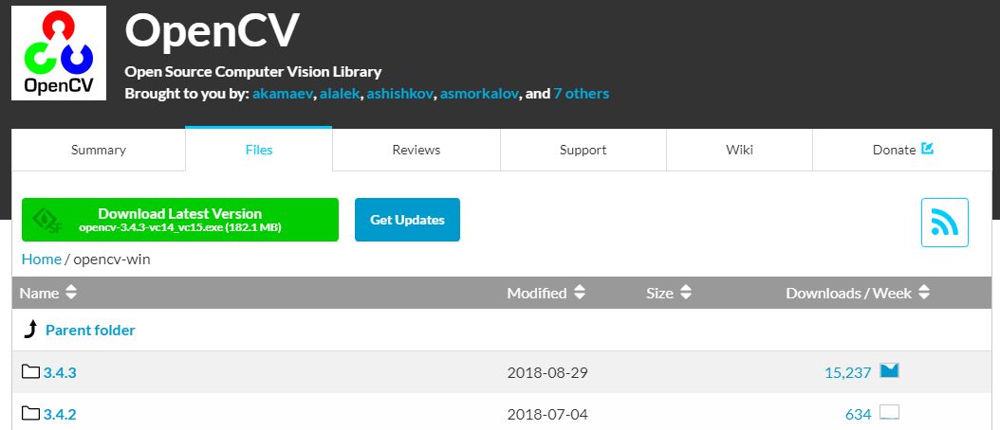

2. 下载CMake的Windows版本（https://cmake.org/download/），目前最新版是3.12.2，下载并安装。

   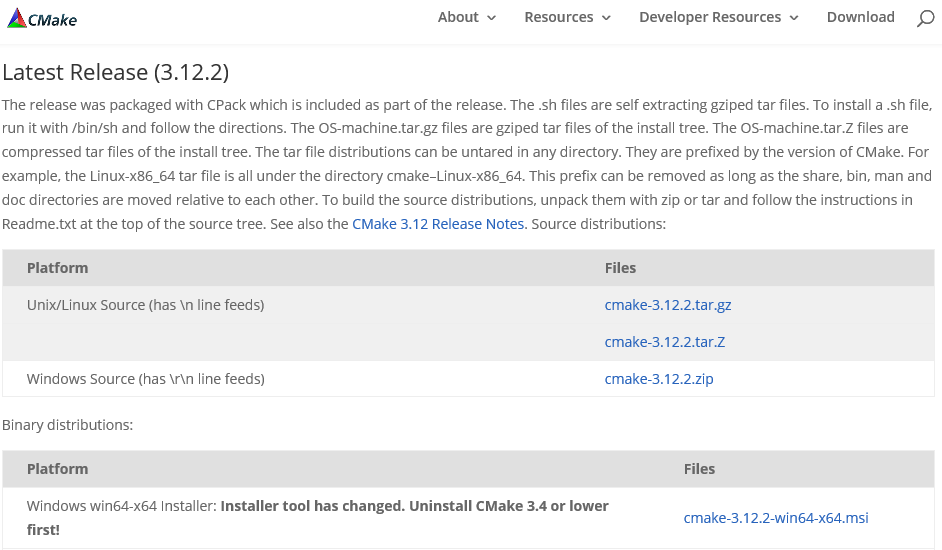

#### 创建OpenCVPlugin工程并配置

现在需要将dlls文件导入Unity，并编写包装类（Wrapper Class）以处理OpenCV和Unity的接口。

1. 打开Visual Studio并创建新项目。项目类型为Visual C++→Other→Empty Project。项目名称改为OpenCVPlugin，点击OK按钮。

   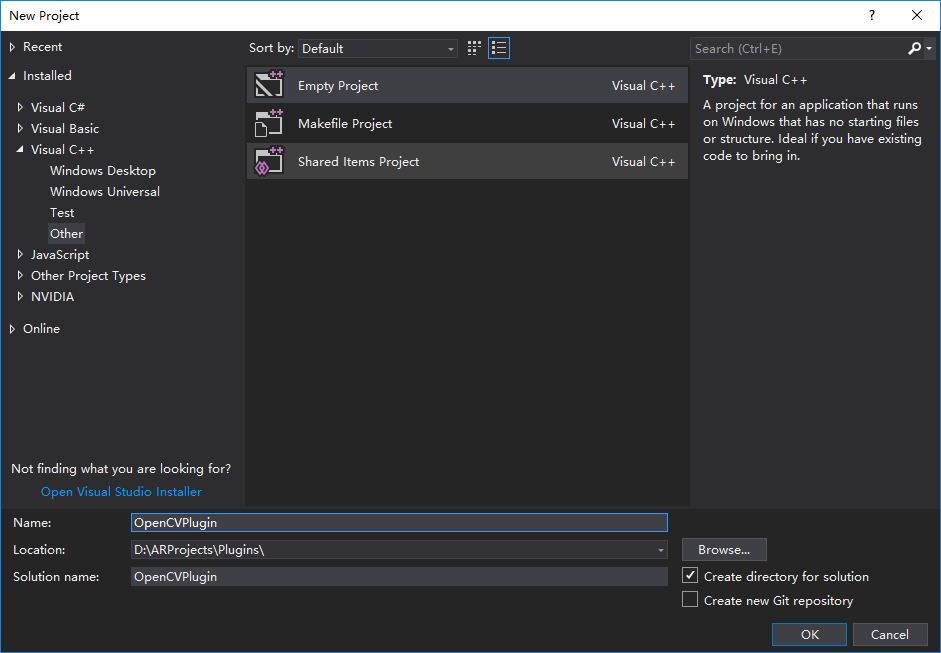

2. 右键点击创建后的项目名称，右键Properties，将Target Extension改为**.dll**，将Configuration Type改为**Dynamic Library (.dll)**

   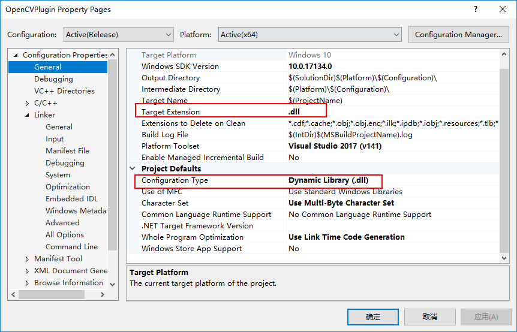

3. 在VC++ Directories，将Include Directories添加OpenCV include路径，如下所示：

   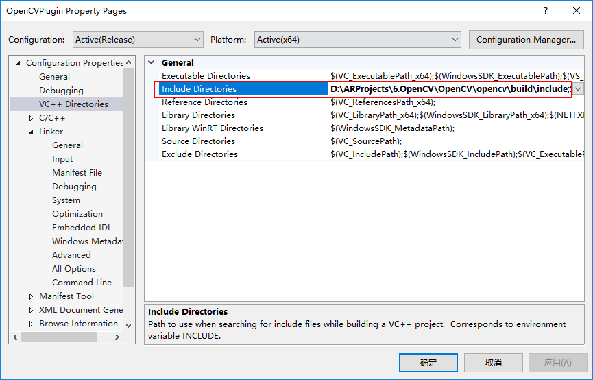

4. 在Linker→General，Additional Library Directories里添加OpenCV lib路径，如下所示：

   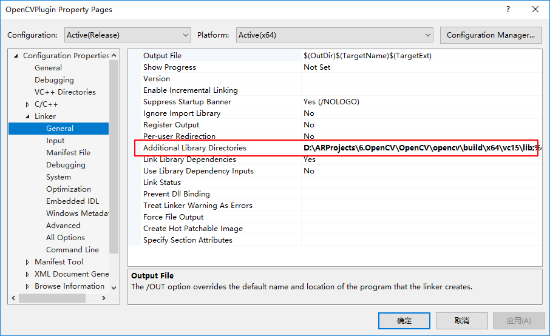

5. 最后，在Linker→Input，在Additional Depenencies添加opencv_world343.lib文件，如下所示：

   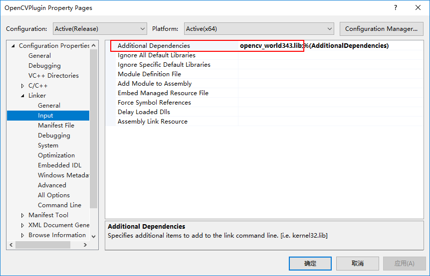

#### 编写C++函数库文件

创建一个新的CPP文件，完成人脸检测功能，如下所示：

```c++
#include "opencv2/objdetect.hpp"
#include "opencv2/highgui.hpp"
#include "opencv2/imgproc.hpp"
#include <iostream>
#include <stdio.h>
using namespace std;
using namespace cv;

struct Circle
{
	Circle(int x, int y, int radius): X(x), Y(y), Radius(radius) {}
	int X, Y, Radius;
};

CascadeClassifier _faceCascade;
String _windowName = "OpenCV";
VideoCapture _capture;
int _scale = 1;

extern "C" int __declspec(dllexport) __stdcall Init(int& outCameraWidth, int& outCameraHeight)
{
	if (!_faceCascade.load("D://lbpcascade_frontalface.xml"))
	{
		return -1;
	}

	_capture.open(0);
	if (!_capture.isOpened())
		return -2;

	outCameraWidth = _capture.get(CAP_PROP_FRAME_WIDTH);
	outCameraHeight = _capture.get(CAP_PROP_FRAME_HEIGHT);
	return 0;
}

extern "C" void __declspec(dllexport) __stdcall Close()
{
	_capture.release();
}

extern "C" void __declspec(dllexport) __stdcall SetScale(int scale)
{
	_scale = scale;
}

extern "C" void __declspec(dllexport) __stdcall Detect(Circle* outFaces, int maxOutFacesCount, int& outDetectdFacesCount)
{
	Mat frame;
	_capture >> frame;
	if (frame.empty())
	{
		return;
	}
	
	std::vector<Rect> faces;
	Mat grayscaleFrame;
	cvtColor(frame, grayscaleFrame, COLOR_BGR2GRAY);
	Mat resizedGray;

	resize(grayscaleFrame, resizedGray, Size(frame.cols / _scale, frame.rows / _scale));
	equalizeHist(resizedGray, resizedGray);

	_faceCascade.detectMultiScale(resizedGray, faces);

	for (size_t i = 0; i < faces.size(); i++)
	{
		Point center(_scale * (faces[i].x + faces[i].width / 2), _scale * (faces[i].y + faces[i].height / 2));
		ellipse(frame, center, Size(_scale * faces[i].width / 2, _scale * faces[i].height / 2), 0, 0, 360, Scalar(0, 0, 255), 4, 8, 0);
		outFaces[i] = Circle(faces[i].x, faces[i].y, faces[i].width / 2);
		outDetectdFacesCount++;

		if (outDetectdFacesCount == maxOutFacesCount)
		{
			break;
		}

		imshow(_windowName, frame);
	}
}
```

> TODO：在程序的第22行，我将_faceCascade中函数load()的参数进行了硬编码，后面会进一步修改。

函数在Solution Explorer选中工程OpenCVPlugin，右击**Build**按钮，即可生成相应的dll文件，位置在x64/Release。

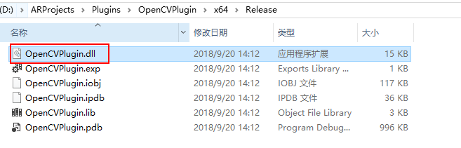

#### 编写C#包装类文件

现在，我们将在Unity中完成剩下的工作。需要编写两个类，一个是OpenCVWrapper包装类，一个是MonoBehavior类OpenCVFaceDetection类。

首先是OpenCVWrapper类，如下所示：

```c#
using System.Runtime.InteropServices;
internal static class OpenCVWrapper {
	[DllImport("OpenCVPlugin")]
	internal static extern int Init(ref int outCamereWidth, ref int outCameraHeight);
	[DllImport("OpenCVPlugin")]
	internal static extern int Close();
	[DllImport("OpenCVPlugin")]
	internal static extern void SetScale(int downscale);
	[DllImport("OpenCVPlugin")]
	internal unsafe static extern void Detect(CvCircle* outFaces, int maxOutFacesCount, ref int outDetectFacesCount);
	
	[StructLayout(LayoutKind.Sequential, Size=12)]
	public struct CvCircle
	{
		public int X, Y, Radius;
	}
}

```

其次是OpenCVFaceDetection类，如下所示：


```c#
using System.Collections;
using System.Collections.Generic;
using UnityEngine;
using System;

public class OpenCVFaceDetection : MonoBehaviour
{

    public Camera camera;
    public static List<Vector2> NormalizedFacePositions { get; private set; }
    public static Vector2 CameraResolution;
    private const int DetectionDownScale = 1;
    private bool _ready;
    private int _maxFaceDetectCount = 5;
    private OpenCVWrapper.CvCircle[] _faces;
    private Quaternion baseRotation;
    private WebCamTexture webCamTexture;

    // Use this for initialization
    void Start()
    {
        int camWidth = 0, camHeight = 0;
        webCamTexture = new WebCamTexture();
        Renderer renderer = GetComponent<Renderer>();
        renderer.material.mainTexture = webCamTexture;
        baseRotation = transform.rotation;
        webCamTexture.Play();
        camWidth = webCamTexture.width;
        camHeight = webCamTexture.height;

        int result = OpenCVWrapper.Init(ref camWidth, ref camHeight);
        if (result < 0)
        {
            if (result == -1)
            {
                Debug.LogWarningFormat("[{0}] Failed to find cascasdes definition.", GetType());
            }
            else if (result == -2)
            {
                Debug.LogWarningFormat("[{0}] Failed to open camera stream.", GetType());
            }
            return;
        }

        CameraResolution = new Vector2(camWidth, camHeight);
        _faces = new OpenCVWrapper.CvCircle[_maxFaceDetectCount];
        NormalizedFacePositions = new List<Vector2>();
        OpenCVWrapper.SetScale(DetectionDownScale);
        _ready = true;
    }

    private void OnApplicationQuit()
    {
        if (_ready)
        {
            OpenCVWrapper.Close();
        }
    }

    // Update is called once per frame
    void Update()
    {
        if (!_ready)
        {
            return;
        }

        transform.rotation = baseRotation * Quaternion.AngleAxis(webCamTexture.videoRotationAngle, Vector3.up);

        int detectedFaceCount = 0;
        unsafe
        {
            fixed (OpenCVWrapper.CvCircle* outFaces = _faces)
            {
                OpenCVWrapper.Detect(outFaces, _maxFaceDetectCount, ref detectedFaceCount);
            }
        }

        NormalizedFacePositions.Clear();
        for (int i = 0; i < detectedFaceCount; i++)
        {
            NormalizedFacePositions.Add(new Vector2((_faces[i].X * DetectionDownScale) / CameraResolution.x, 1f - ((_faces[i].Y * DetectionDownScale) / CameraResolution.y)));
        }
    }
}

```

#### Unity设置

写完代码，转到Unity编辑器后，你会发现Unity会报错，大致是*unsafe code needs to be allowed*，需要转到**Player Settings**，在**Other Settings**里找到**Allow ‘unsafe’ Code**，并勾选。

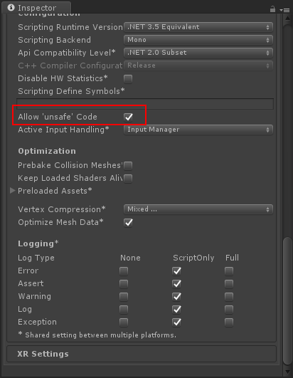

将OpenCV\opencv\build\etc\lbpcascades下的lbpcascade_frontalface.xml文件拷贝到D盘根目录下（与插件中Init()函数保持一致）；将OpenCV\opencv\build\x64\vc15\bin下的opencv_world343.dll和opencv_ffmpeg343_64.dll拷贝到Unity中Assets/Plugins文件夹下，如下所示：

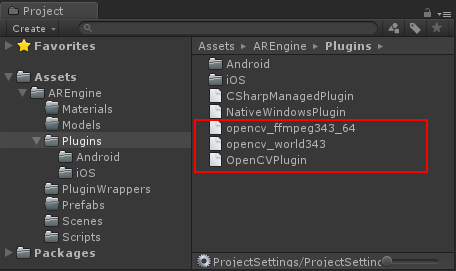

最后，在Unity场景中创建一个Plane物体，将其X轴旋转-90度以朝向Main Camera，将OpenCVFaceDetection脚本挂载到物体下，并将Mian Camera赋于其Camera字段值，如下所示：

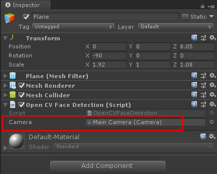

这样，就完成了我们的插件工程，将摄像头插到电脑上，点击运行，即可看到如下画面。

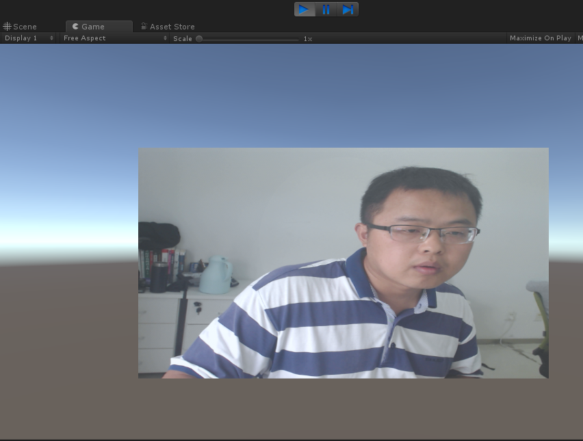

> TODO：程序并没有实现预期效果，且运行帧率很低，目前分析有两个原因，一个是代码有bug，一个是程序没有用协程来处理，以至于来不及检测，后面我将进一步完善。

---
参考文献：

[Unity 2018 Augmented Reality Projects](https://www.packtpub.com/game-development/unity-2018-augmented-reality-projects)